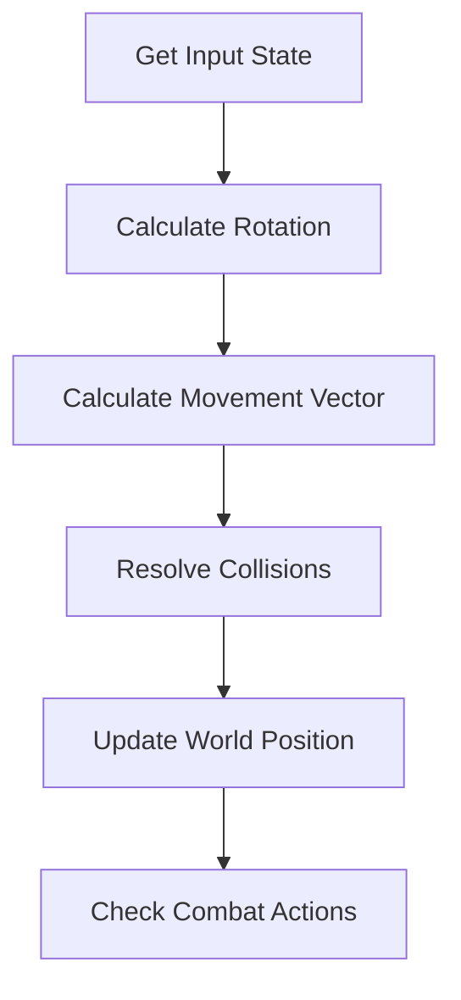

# 👤 Player Subsystem (`srcs/gameplay/player`)

---

## 🚧 Subsystem Boundary
> [!NOTE]
> **Trigger:** Activated every frame to process input and update the player's physical presence.
> 
> **Output:** Mutates the `t_player` structure (position, rotation, health) for the renderer.

---

## ✅ Responsibilities & ❌ Anti-Responsibilities
- **Must:** Manage the high-level player state (Position, Health, Inventory).
- **Must:** Coordinate between movement physics and raw inputs.
- **Must:** Initialize the player at the correct map starting position.
- **Must Not:** Draw the 3D view (delegated to `engine/render/`).
- **Must Not:** Handle raw keyboard/mouse events (delegated to `inputs/`).

---

## 🔄 Player Update Loop

---

## 🧬 Player Logic Matrix
| Feature | Implementation | Purpose |
| :--- | :--- | :--- |
| **Movement** | `movement.c` | Velocity application and wall sliding. |
| **Controller** | `controller.c` | High-level orchestration of player actions. |
| **Startup** | `start.c` / `init.c` | Spawning and initial state setup. |

---

## ⚠️ Edge Cases & Gotchas
> [!IMPORTANT]
> **Collision Radius:** The player is not a single point; they have a physical thickness. The `movement.c` module must use a radius-based collision check to prevent the camera from clipping into walls.

---

## 🗂️ Files Inventory
| File | Primary Function | Role |
| :--- | :--- | :--- |
| `controller.c` | `player_update()` | Primary entry point for the player tick. |
| `movement.c` | `apply_movement()` | Resolves physical displacement in the world. |
| `init.c` | `player_init()` | Allocates and initializes the player structure. |
| `start.c` | `player_spawn()` | Positions the player based on map start markers (N, S, E, W). |
