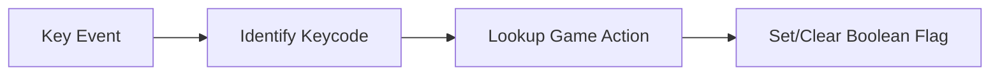

# ⌨️ Keyboard Input Handler (`srcs/gameplay/player/inputs/keyboard`)

---

## 🚧 Subsystem Boundary
> [!NOTE]
> **Trigger:** Triggered by MLX keypress and keyrelease events.
> 
> **Output:** Mutates the boolean flag array in the player's input state.

---

## ✅ Responsibilities & ❌ Anti-Responsibilities
- **Must:** Track the active state of all bound keys (W, A, S, D, Space, etc.).
- **Must:** Map OS-specific keycodes to internal game actions.
- **Must Not:** Directly update the player's position (delegated to `player/movement.c`).
- **Must Not:** Handle mouse events (delegated to `inputs/mouse/`).

---

## 🔄 Input Mapping Flow

---

## 🧬 Keyboard Matrix
| Feature | Implementation | Purpose |
| :--- | :--- | :--- |
| **Mapping** | `keymap.c` | Defines the relationship between keys and actions. |
| **Press** | `press.c` | Logic for `KeyDown` events. |
| **Release** | `release.c` | Logic for `KeyUp` events. |

---

## ⚠️ Edge Cases & Gotchas
> [!WARNING]
> **Repeated Keys:** The system must ignore "auto-repeat" events sent by the OS while a key is held down to prevent input flickering.

---

## 🗂️ Files Inventory
| File | Primary Function | Role |
| :--- | :--- | :--- |
| `keymap.c` | `get_action()` | Translates keycodes to `t_action` enums. |
| `press.c` | `handle_keypress()` | Sets flags in the `t_input` struct. |
| `release.c` | `handle_keyrelease()` | Clears flags in the `t_input` struct. |
