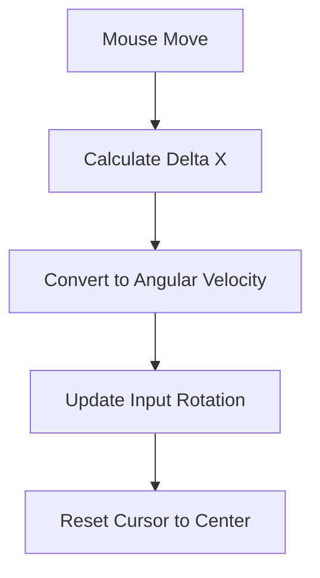

# 🖱️ Mouse Input Handler (`srcs/gameplay/player/inputs/mouse`)

---

## 🚧 Subsystem Boundary
> [!NOTE]
> **Trigger:** Triggered by MLX mouse motion and button events.
> 
> **Output:** Provides rotation deltas and button click flags to the player controller.

---

## ✅ Responsibilities & ❌ Anti-Responsibilities
- **Must:** Calculate the delta movement of the mouse cursor between frames.
- **Must:** Handle mouse button clicks for shooting or interaction.
- **Must:** Manage pointer locking/hiding to enable infinite rotation.
- **Must Not:** Apply the rotation to the player (delegated to `player/controller.c`).
- **Must Not:** Handle movement keys (delegated to `inputs/keyboard/`).

---

## 🔄 Mouse Processing

---

## 🧬 Mouse Matrix
| Feature | Implementation | Purpose |
| :--- | :--- | :--- |
| **Motion** | `motion.c` | Translates pixel delta to radians. |
| **Buttons** | `press.c` / `release.c` | Handles fire and interaction clicks. |
| **Setup** | `init.c` | Configures MLX mouse hooks and hiding. |

---

## ⚠️ Edge Cases & Gotchas
> [!CAUTION]
> **Cursor Warping:** To prevent the mouse from leaving the window, the cursor is warped back to the center of the screen after every delta calculation. The system must ignore this "warp" move to avoid infinite feedback loops.

---

## 🗂️ Files Inventory
| File | Primary Function | Role |
| :--- | :--- | :--- |
| `motion.c` | `handle_mouse_move()` | Main logic for camera rotation. |
| `press.c` | `handle_button_press()` | Triggers primary fire or interaction. |
| `init.c` | `mouse_init()` | Enables/Disables the system and hides the cursor. |
