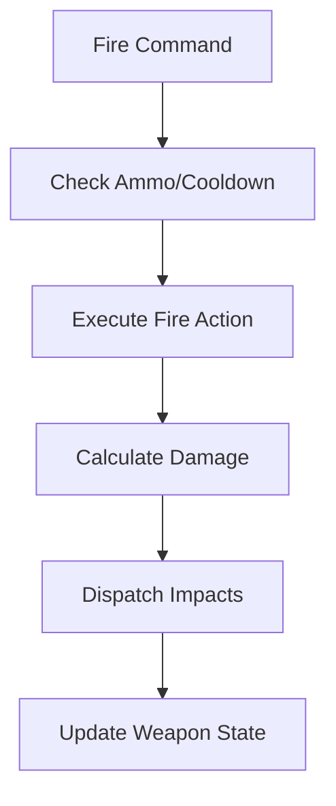

# 🔫 Combat Logic Subsystem (`srcs/gameplay/weapon`)

---

## 🚧 Subsystem Boundary
> [!NOTE]
> **Trigger:** Activated by the player or monster AI when a "Fire" command is issued.
> 
> **Output:** Dispatches combat events, calculates hit results, and manages common weapon state utilities.

---

## ✅ Responsibilities & ❌ Anti-Responsibilities
- **Must:** Orchestrate the transition from "Intent to Fire" to "Result of Fire".
- **Must:** Provide centralized utilities for damage calculation and recoil.
- **Must:** Dispatch effects (sound triggers, visual impact flags).
- **Must Not:** Handle individual projectile physics (delegated to `entities/projectile/`).
- **Must Not:** Manage player inventory (delegated to `gameplay/player/`).

---

## 🔄 Combat Orchestration

---

## 🧬 Sub-Modules Matrix
| Module | Role | Documentation |
| :--- | :--- | :--- |
| **`fire/`** | Hit Resolution | [README](fire/README.md) |
| **`utils.c`** | Common Logic | *Internal* |

---

## ⚠️ Edge Cases & Gotchas
> [!IMPORTANT]
> **Friendly Fire:** The combat system must validate the "Team" or "Owner" of a weapon fire action to prevent entities from accidentally damaging themselves or allies during dense combat.

---

## 🗂️ Files Inventory
| File | Primary Function | Role |
| :--- | :--- | :--- |
| `utils.c` | `get_damage_modifier()` | Utility for calculating distance-based damage falloff. |
