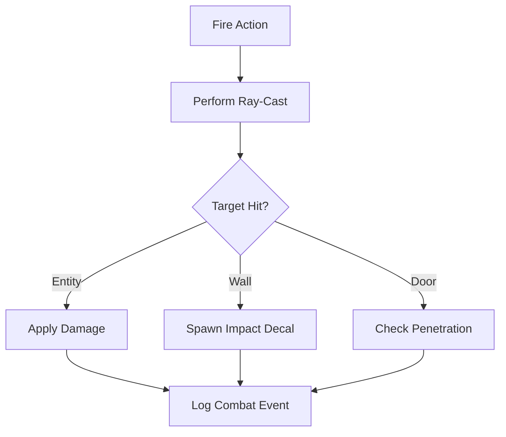

# 🔥 Weapon Fire Action Module (`srcs/gameplay/weapon/fire`)

---

## 🚧 Subsystem Boundary
> [!NOTE]
> **Trigger:** Called by the weapon orchestrator when a firing event is validated.
> 
> **Output:** Resolves the intersection between the shot and the world, applying damage and spawning visual cues.

---

## ✅ Responsibilities & ❌ Anti-Responsibilities
- **Must:** Perform hitscan ray-casting for instant-hit weapons.
- **Must:** Resolve "bullet through door" logic.
- **Must:** Apply damage to the target entity's `t_combat` component.
- **Must:** Generate impact coordinates for decal or particle spawning.
- **Must Not:** Handle weapon animations (delegated to `entities/weapon/`).
- **Must Not:** Handle projectile movement (delegated to `entities/projectile/`).

---

## 🔄 Fire Resolution Pipeline

---

## 🧬 Action Matrix
| Feature | Implementation | Purpose |
| :--- | :--- | :--- |
| **Action** | `action.c` | Core logic for initiating the shot. |
| **Damage** | `damage.c` | Interface for modifying entity health pools. |
| **Door** | `door.c` | Special handling for shooting through open/closing doors. |
| **Impact** | `impact.c` | Calculates coordinates and surface normals for effects. |

---

## ⚠️ Edge Cases & Gotchas
> [!CAUTION]
> **Hit Registration:** Due to the grid-based nature of the world, hits at the extreme edges of wall cells must be carefully validated to ensure they don't "leak" into the neighboring empty space.

---

## 🗂️ Files Inventory
| File | Primary Function | Role |
| :--- | :--- | :--- |
| `action.c` | `resolve_fire()` | The primary entry point for hitscan resolution. |
| `damage.c` | `dispatch_damage()` | Mutates the health state of the target entity. |
| `impact.c` | `calculate_impact()` | Returns world-space coordinates for visual effects. |
