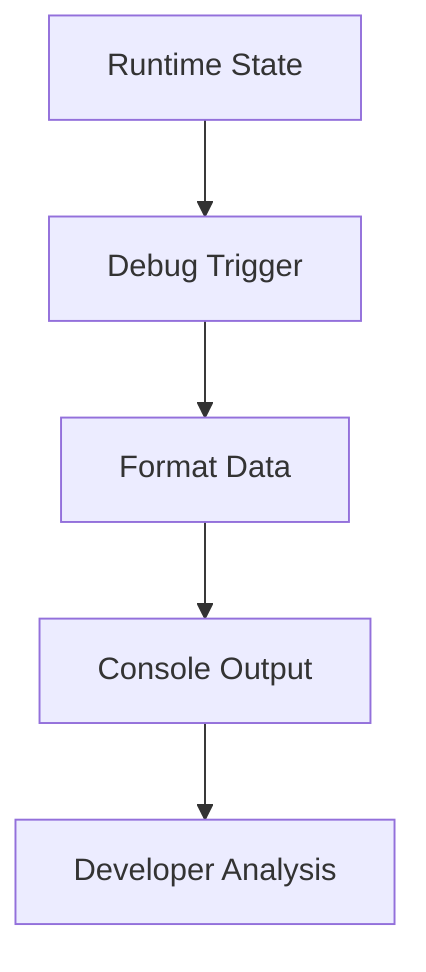
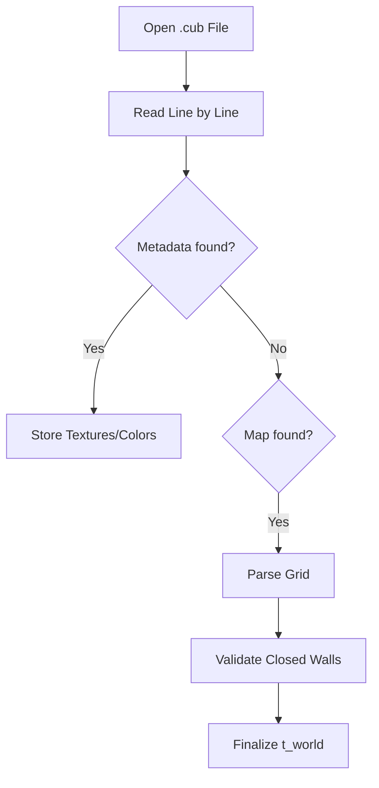

# 🐞 Debugging Tools (`srcs/helpers/debug`)

---

## 🚧 Subsystem Boundary
> [!NOTE]
> **Trigger:** Manually invoked by developers during the development cycle to inspect internal engine states.
> 
> **Output:** Formatted console logs displaying the map grid, player vectors, or BVH hierarchies.

---

## ✅ Responsibilities & ❌ Anti-Responsibilities
- **Must:** Provide functions to print the 2D map grid to `STDOUT`.
- **Must:** Log player position, direction, and FOV vectors for alignment checking.
- **Must:** Visualize the SAH BVH tree structure (depth and node bounds).
- **Must Not:** Be compiled into the final production binary (if using strict size limits).
- **Must Not:** Draw to the MLX window (use `STDOUT/STDERR` only).

---

## 🔄 Debugging Flow

---

## 🧬 Inspection Matrix
| Feature | Implementation | Output Format |
| :--- | :--- | :--- |
| **Map Grid** | Nested Loops | ASCII Matrix with 'P' for player. |
| **Player State** | `printf` formatters | `Pos: (x, y) | Dir: (dx, dy)` |
| **BVH Tree** | Recursive Traversal | Indented tree showing AABB bounds. |

---

## ⚠️ Edge Cases & Gotchas
> [!WARNING]
> **Performance Impact:** Printing the map grid every frame will severely bottleneck the engine. These tools should only be used in specific debugging branches or triggered via keyboard shortcuts.

---

## 🗂️ Files Inventory
| File | Primary Function | Role |
| :--- | :--- | :--- |
| `print.c` | `print_map()` | Collection of ASCII visualization utilities. |

---

## 🚧 Subsystem Boundary
> [!NOTE]
> **Trigger:** Called by all subsystems for specific utility tasks (parsing, math, exit handling).
> 
> **Output:** Provides validated results (like a parsed world state) or performs terminal actions (like printing errors and exiting).

---

## ✅ Responsibilities & ❌ Anti-Responsibilities
- **Must:** Parse and validate the `.cub` configuration file.
- **Must:** Provide high-level math utilities (distance, trigonometry).
- **Must:** Manage the application's "Safe Exit" lifecycle.
- **Must:** Implement generic string and list manipulation helpers.
- **Must Not:** Define core data structures (delegated to `primitives/`).
- **Must Not:** Contain game loop logic (delegated to `core/`).

---

## 🔄 Parsing Pipeline

---

## 💾 Memory Contracts (Critical)
| Function Allocates | Freeing Responsibility | Condition |
| :--- | :--- | :--- |
| `get_next_line()` | `parse_file()` | Temporary strings during parsing must be freed immediately after consumption. |
| `safe_exit()` | **Recursive Teardown** | This function is the ultimate "Memory Garbage Collector" during any exit scenario. |

---

## 🧬 Utility Matrix
| Feature | Implementation | Notes |
| :--- | :--- | :--- |
| **Parsing** | State-machine based | Handles metadata and map data in a single pass. |
| **Error Handling** | Prefix-based reporting | Prints "Error\n" followed by a specific message to `STDERR`. |
| **Math** | Fast lookup tables | (Optional) Can be used for trig functions if performance is critical. |

---

## ⚠️ Edge Cases & Gotchas
> [!CAUTION]
> **Hanging File Descriptors:** If parsing fails midway, the `safe_exit` routine must ensure that any open file descriptors are properly closed to avoid system resource exhaustion.

---

## 🗂️ Files Inventory
| File | Primary Function | Role |
| :--- | :--- | :--- |
| `parser.c` | `parse_cub()` | Orchestrates the translation of text files into world state. |
| `exit.c` | `safe_exit()` | Centralized error reporting and memory cleanup. |
| `maths.c` | `get_dist()` | General math utility library. |
| `debug.c` | `print_world()` | Internal tools for visualizing state during development. |
