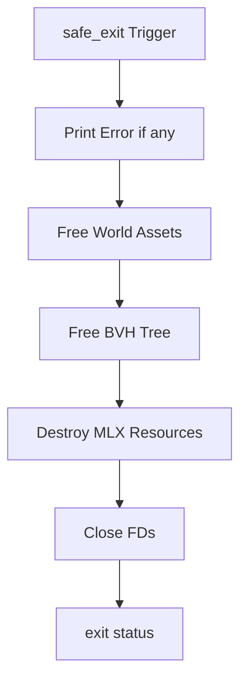

# 🚪 Exit & Cleanup Handler (`srcs/helpers/exit`)

---

## 🚧 Subsystem Boundary
> [!NOTE]
> **Trigger:** Invoked during fatal errors, window closure, or successful application termination.
> 
> **Output:** Recursively frees all heap-allocated resources and exits the process with a status code.

---

## ✅ Responsibilities & ❌ Anti-Responsibilities
- **Must:** Provide the `safe_exit()` "God Function" for all termination paths.
- **Must:** Recursively free the `t_world` (map, sprites, textures, BVH).
- **Must:** Close the MLX window and destroy the display connection.
- **Must:** Print detailed error messages to `STDERR` if a failure occurred.
- **Must Not:** Handle game logic or rendering (delegated to `gameplay/` and `engine/`).

---

## 🔄 Teardown Sequence

---

## 💾 Cleanup Registry
| Asset Type | Primary Cleanup Function | Condition |
| :--- | :--- | :--- |
| **Map Grid** | `free_map_grid()` | Always freed if allocated. |
| **BVH Tree** | `free_bvh_nodes()` | Recursive free for all tree nodes. |
| **MLX Image** | `mlx_destroy_image()` | One call per loaded texture. |
| **MLX Window** | `mlx_destroy_window()` | Called once during shutdown. |

---

## ⚠️ Edge Cases & Gotchas
> [!IMPORTANT]
> **Order of Operations:** MLX images must be destroyed BEFORE the display connection is closed via `mlx_destroy_display`. Failure to follow this order may lead to X11 protocol errors.

---

## 🗂️ Files Inventory
| File | Primary Function | Role |
| :--- | :--- | :--- |
| `cleanup.c` | `free_world()` | Recursive logic for deep resource freeing. |
| `error.c` | `safe_exit()` | Centralized entry point for all termination logic. |

