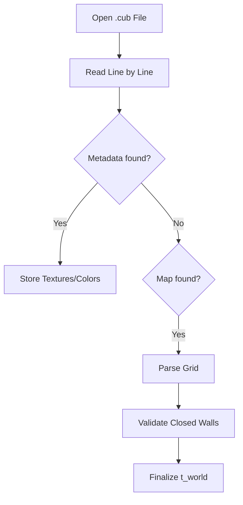

# 📐 2D Vector Library (`srcs/helpers/maths/vec2`)

---

## 🚧 Subsystem Boundary
> [!NOTE]
> **Trigger:** Used extensively by the `engine/` for raycasting and `gameplay/` for player movement.
> 
> **Output:** Provides low-level mathematical primitives for 2D spatial calculations.

---

## ✅ Responsibilities & ❌ Anti-Responsibilities
- **Must:** Provide `t_vec2` (double) and `t_vec2i` (int) structures.
- **Must:** Implement core arithmetic: Addition, Subtraction, Multiplication, Scaling.
- **Must:** Implement vector-specific operations: Normalization, Distance, Dot Product.
- **Must Not:** Handle 3D geometry (delegated to `vec3/`).
- **Must Not:** Handle rendering or collision logic (delegated to `engine/` and `gameplay/`).

---

## 🔄 Operation Flow

---

## 🧬 Vector Operations Matrix
| Operation | Variants | Usage |
| :--- | :--- | :--- |
| **Arithmetic** | Add, Sub, Mul, Div | Position updates and scaling. |
| **Distance** | `vec2_dist`, `vec2_dist_sq` | Collision and proximity checks. |
| **Direction** | `vec2_normalize` | Ray direction unit vectors. |

---

## ⚠️ Edge Cases & Gotchas
> [!CAUTION]
> **Division by Zero:** The `vec2_normalize` and `vec2_div` functions must guard against zero-length vectors to prevent NaN results or crashes.

---

## 🗂️ Files Inventory
| File | Primary Function | Role |
| :--- | :--- | :--- |
| `vec2.c` | `vec2_new()` | Double-precision vector operations. |
| `vec2i.c` | `vec2i_new()` | Integer-precision vector operations (grid indices). |
| `utils.c` | `vec2_dist()` | Higher-level geometric utilities. |

---

## 🚧 Subsystem Boundary
> [!NOTE]
> **Trigger:** Called by all subsystems for specific utility tasks (parsing, math, exit handling).
> 
> **Output:** Provides validated results (like a parsed world state) or performs terminal actions (like printing errors and exiting).

---

## ✅ Responsibilities & ❌ Anti-Responsibilities
- **Must:** Parse and validate the `.cub` configuration file.
- **Must:** Provide high-level math utilities (distance, trigonometry).
- **Must:** Manage the application's "Safe Exit" lifecycle.
- **Must:** Implement generic string and list manipulation helpers.
- **Must Not:** Define core data structures (delegated to `primitives/`).
- **Must Not:** Contain game loop logic (delegated to `core/`).

---

## 🔄 Parsing Pipeline

---

## 💾 Memory Contracts (Critical)
| Function Allocates | Freeing Responsibility | Condition |
| :--- | :--- | :--- |
| `get_next_line()` | `parse_file()` | Temporary strings during parsing must be freed immediately after consumption. |
| `safe_exit()` | **Recursive Teardown** | This function is the ultimate "Memory Garbage Collector" during any exit scenario. |

---

## 🧬 Utility Matrix
| Feature | Implementation | Notes |
| :--- | :--- | :--- |
| **Parsing** | State-machine based | Handles metadata and map data in a single pass. |
| **Error Handling** | Prefix-based reporting | Prints "Error\n" followed by a specific message to `STDERR`. |
| **Math** | Fast lookup tables | (Optional) Can be used for trig functions if performance is critical. |

---

## ⚠️ Edge Cases & Gotchas
> [!CAUTION]
> **Hanging File Descriptors:** If parsing fails midway, the `safe_exit` routine must ensure that any open file descriptors are properly closed to avoid system resource exhaustion.

---

## 🗂️ Files Inventory
| File | Primary Function | Role |
| :--- | :--- | :--- |
| `parser.c` | `parse_cub()` | Orchestrates the translation of text files into world state. |
| `exit.c` | `safe_exit()` | Centralized error reporting and memory cleanup. |
| `maths.c` | `get_dist()` | General math utility library. |
| `debug.c` | `print_world()` | Internal tools for visualizing state during development. |
