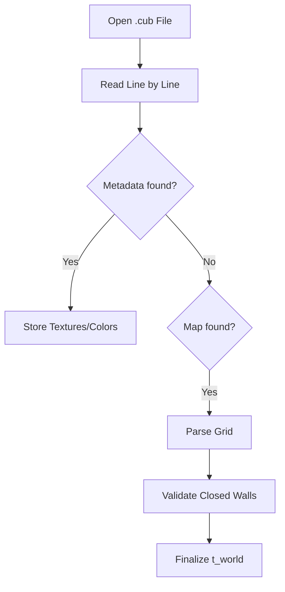

# 📐 3D Vector Library (`srcs/helpers/maths/vec3`)

---

## 🚧 Subsystem Boundary
> [!NOTE]
> **Trigger:** Used for complex spatial partitioning (BVH), sprite depth calculations, and UV mapping.
> 
> **Output:** Provides 3-component mathematical primitives for spatial logic.

---

## ✅ Responsibilities & ❌ Anti-Responsibilities
- **Must:** Provide `t_vec3` (double) and `t_vec3i` (int) structures.
- **Must:** Implement vector math: Cross Product, Dot Product, Length.
- **Must:** Support interpolation (lerp) for smooth animations or color gradients.
- **Must Not:** Handle 2D raycasting (delegated to `vec2/` for performance).
- **Must Not:** Perform matrix transformations (unless needed for complex camera moves).

---

## 🔄 Spatial Pipeline

---

## 🧬 Vector Operations Matrix
| Operation | Variants | Usage |
| :--- | :--- | :--- |
| **Arithmetic** | Add, Sub, Mul, Scale | General spatial manipulation. |
| **Geometric** | Cross, Dot, Length | Collision normals and lighting logic. |
| **Interpolation** | `vec3_lerp` | Smooth state transitions. |

---

## ⚠️ Edge Cases & Gotchas
> [!WARNING]
> **Performance Overhead:** While `vec3` provides more data, it is computationally more expensive than `vec2`. Use `vec2` for core ray-steps unless 3D depth or verticality is strictly required.

---

## 🗂️ Files Inventory
| File | Primary Function | Role |
| :--- | :--- | :--- |
| `vec3.c` | `vec3_add()` | Double-precision 3D arithmetic. |
| `vec3i.c` | `vec3i_add()` | Integer-precision 3D arithmetic. |
| `utils.c` | `vec3_cross()` | Advanced geometric products. |

---

## 🚧 Subsystem Boundary
> [!NOTE]
> **Trigger:** Called by all subsystems for specific utility tasks (parsing, math, exit handling).
> 
> **Output:** Provides validated results (like a parsed world state) or performs terminal actions (like printing errors and exiting).

---

## ✅ Responsibilities & ❌ Anti-Responsibilities
- **Must:** Parse and validate the `.cub` configuration file.
- **Must:** Provide high-level math utilities (distance, trigonometry).
- **Must:** Manage the application's "Safe Exit" lifecycle.
- **Must:** Implement generic string and list manipulation helpers.
- **Must Not:** Define core data structures (delegated to `primitives/`).
- **Must Not:** Contain game loop logic (delegated to `core/`).

---

## 🔄 Parsing Pipeline

---

## 💾 Memory Contracts (Critical)
| Function Allocates | Freeing Responsibility | Condition |
| :--- | :--- | :--- |
| `get_next_line()` | `parse_file()` | Temporary strings during parsing must be freed immediately after consumption. |
| `safe_exit()` | **Recursive Teardown** | This function is the ultimate "Memory Garbage Collector" during any exit scenario. |

---

## 🧬 Utility Matrix
| Feature | Implementation | Notes |
| :--- | :--- | :--- |
| **Parsing** | State-machine based | Handles metadata and map data in a single pass. |
| **Error Handling** | Prefix-based reporting | Prints "Error\n" followed by a specific message to `STDERR`. |
| **Math** | Fast lookup tables | (Optional) Can be used for trig functions if performance is critical. |

---

## ⚠️ Edge Cases & Gotchas
> [!CAUTION]
> **Hanging File Descriptors:** If parsing fails midway, the `safe_exit` routine must ensure that any open file descriptors are properly closed to avoid system resource exhaustion.

---

## 🗂️ Files Inventory
| File | Primary Function | Role |
| :--- | :--- | :--- |
| `parser.c` | `parse_cub()` | Orchestrates the translation of text files into world state. |
| `exit.c` | `safe_exit()` | Centralized error reporting and memory cleanup. |
| `maths.c` | `get_dist()` | General math utility library. |
| `debug.c` | `print_world()` | Internal tools for visualizing state during development. |
