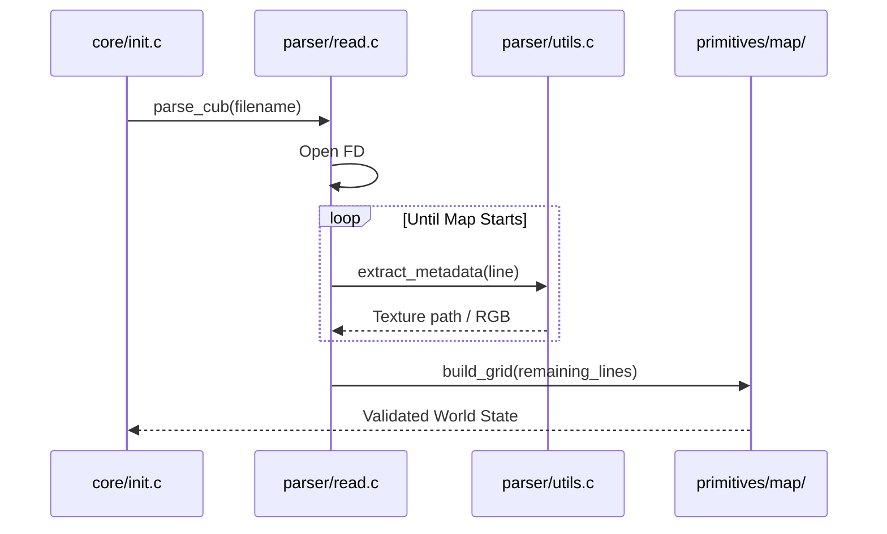
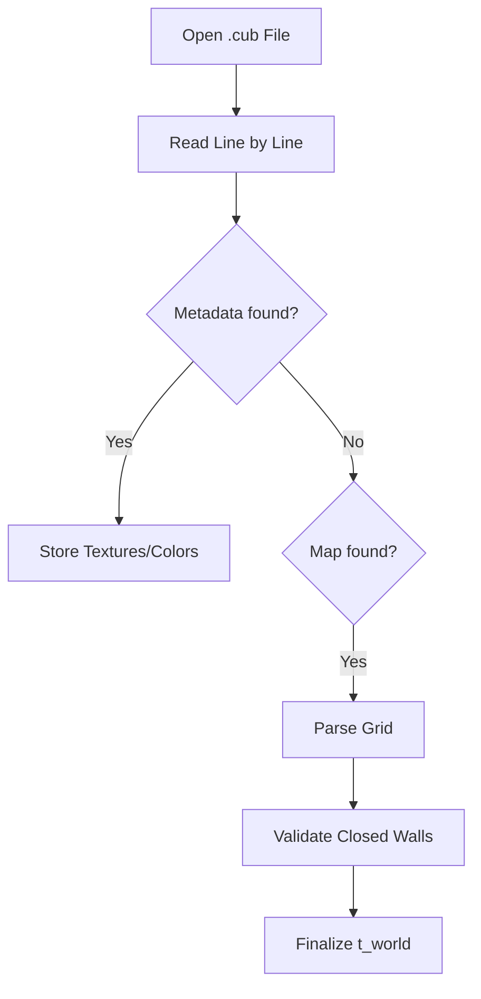

# 📜 Configuration Parser (`srcs/helpers/parser`)

---

## 🚧 Subsystem Boundary
> [!NOTE]
> **Trigger:** Called by `core/init.c` at the very start of the application.
> 
> **Output:** Populates the `t_world` structure with validated textures, colors, and map data.

---

## ✅ Responsibilities & ❌ Anti-Responsibilities
- **Must:** Open and read the `.cub` file using `get_next_line`.
- **Must:** Validate the existence and format of texture paths.
- **Must:** Parse RGB colors and handle malformed input strings.
- **Must:** Ensure the map grid follows 42's strict formatting rules.
- **Must Not:** Load textures into MLX memory (delegated to `primitives/textures/`).
- **Must Not:** Initialize the MLX display (delegated to `window/`).

---

## 🔄 Parsing Sequence

---

## 💾 Memory Contracts (Critical)
| Function Allocates | Freeing Responsibility | Condition |
| :--- | :--- | :--- |
| `get_next_line()` | `read.c` | Every line returned by GNL must be freed immediately after parsing. |
| `ft_split()` | `utils.c` | Metadata strings must be trimmed and freed to prevent startup leaks. |

---

## 🧬 Validation Matrix
| Element | Check | Consequence |
| :--- | :--- | :--- |
| **Texture Path** | `access(path, R_OK)` | `safe_exit` if path is invalid. |
| **RGB Range** | `0 <= color <= 255` | `safe_exit` on out-of-bounds values. |
| **Map Characters** | `[0,1,N,S,E,W,D,P]` | `safe_exit` on unknown symbols. |

---

## ⚠️ Edge Cases & Gotchas
> [!CAUTION]
> **Duplicate Keys:** The parser must throw an error if a metadata key (e.g., `NO`, `SO`) is defined multiple times in the same file.

---

## 🗂️ Files Inventory
| File | Primary Function | Role |
| :--- | :--- | :--- |
| `read.c` | `get_config()` | Overarching file reading loop. |
| `init.c` | `init_parser()` | Setup temporary parsing states. |
| `utils.c` | `parse_color()` | String-to-RGB conversion and validation. |

---

## 🚧 Subsystem Boundary
> [!NOTE]
> **Trigger:** Called by all subsystems for specific utility tasks (parsing, math, exit handling).
> 
> **Output:** Provides validated results (like a parsed world state) or performs terminal actions (like printing errors and exiting).

---

## ✅ Responsibilities & ❌ Anti-Responsibilities
- **Must:** Parse and validate the `.cub` configuration file.
- **Must:** Provide high-level math utilities (distance, trigonometry).
- **Must:** Manage the application's "Safe Exit" lifecycle.
- **Must:** Implement generic string and list manipulation helpers.
- **Must Not:** Define core data structures (delegated to `primitives/`).
- **Must Not:** Contain game loop logic (delegated to `core/`).

---

## 🔄 Parsing Pipeline

---

## 💾 Memory Contracts (Critical)
| Function Allocates | Freeing Responsibility | Condition |
| :--- | :--- | :--- |
| `get_next_line()` | `parse_file()` | Temporary strings during parsing must be freed immediately after consumption. |
| `safe_exit()` | **Recursive Teardown** | This function is the ultimate "Memory Garbage Collector" during any exit scenario. |

---

## 🧬 Utility Matrix
| Feature | Implementation | Notes |
| :--- | :--- | :--- |
| **Parsing** | State-machine based | Handles metadata and map data in a single pass. |
| **Error Handling** | Prefix-based reporting | Prints "Error\n" followed by a specific message to `STDERR`. |
| **Math** | Fast lookup tables | (Optional) Can be used for trig functions if performance is critical. |

---

## ⚠️ Edge Cases & Gotchas
> [!CAUTION]
> **Hanging File Descriptors:** If parsing fails midway, the `safe_exit` routine must ensure that any open file descriptors are properly closed to avoid system resource exhaustion.

---

## 🗂️ Files Inventory
| File | Primary Function | Role |
| :--- | :--- | :--- |
| `parser.c` | `parse_cub()` | Orchestrates the translation of text files into world state. |
| `exit.c` | `safe_exit()` | Centralized error reporting and memory cleanup. |
| `maths.c` | `get_dist()` | General math utility library. |
| `debug.c` | `print_world()` | Internal tools for visualizing state during development. |
