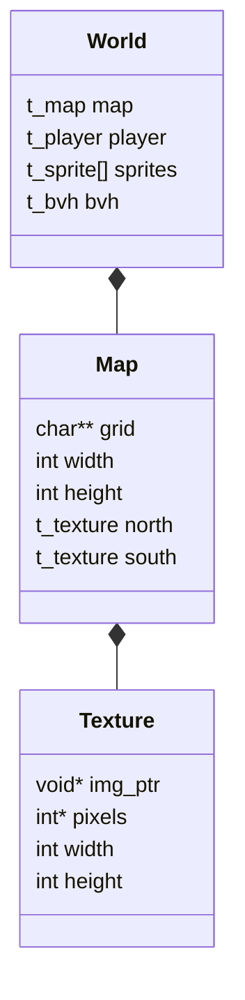

# 🧱 Primitives Subsystem (`srcs/primitives`)

---

## 🚧 Subsystem Boundary
> [!NOTE]
> **Trigger:** Initialized during map parsing and utilized by all other subsystems (Engine, Gameplay, Core).
> 
> **Output:** Provides structured data models for the game world, including the grid, textures, and spatial vectors.

---

## ✅ Responsibilities & ❌ Anti-Responsibilities
- **Must:** Define and manage the `t_map` structure (grid, dimensions).
- **Must:** Define the `t_vec2` and `t_vec3` math primitives.
- **Must:** Store raw texture data (XPM pixels) and metadata.
- **Must:** Provide utility functions for vector arithmetic.
- **Must Not:** Perform raycasting (delegated to `engine/`).
- **Must Not:** Handle input events (delegated to `window/`).

---

## 🔄 Data Relationship Diagram

---

## 💾 Memory Contracts (Critical)
| Structure | Freeing Responsibility | Condition |
| :--- | :--- | :--- |
| `t_map.grid` | `free_map()` | A 2D char array must be freed row by row. |
| `t_texture` | `mlx_destroy_image()` | Must be called for every loaded XPM image. |

---

## 🧬 Primitive Types Matrix
| Type | Usage | Optimization |
| :--- | :--- | :--- |
| **`t_vec2`** | 2D coordinates (Player, Rays) | Uses `double` for precision. |
| **`t_vec2i`** | Grid indices | Integer-only for fast map lookups. |
| **`t_ray`** | Ray state (Origin, Dir) | Packed struct for cache efficiency. |

---

## ⚠️ Edge Cases & Gotchas
> [!CAUTION]
> **Index Out of Bounds:** Any access to the map grid must be guarded by range checks against `map.width` and `map.height` to prevent segfaults.

---

## 🗂️ Files Inventory
| File | Primary Function | Role |
| :--- | :--- | :--- |
| `map.c` | `init_map()` | Manages grid allocation and metadata. |
| `texture.c` | `load_texture()` | Wraps MLX image loading for XPMs. |
| `vector.c` | `vec_add() / vec_mul()` | Math library for vector operations. |
