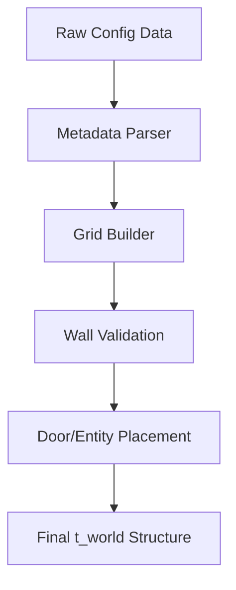

# 🗺️ Map Subsystem (`srcs/primitives/map`)

---

## 🚧 Subsystem Boundary
> [!NOTE]
> **Trigger:** Initialized during the application startup via the `core/init.c` flow.
> 
> **Output:** A structured `t_world` state containing the grid, doors, and metadata used for both physics and rendering.

---

## ✅ Responsibilities & ❌ Anti-Responsibilities
- **Must:** Parse the `.cub` file and translate it into a memory-resident 2D grid.
- **Must:** Validate map "closedness" and player starting positions.
- **Must:** Manage dynamic elements like doors and their open/closed states.
- **Must:** Support advanced primitives like lines and portals for complex world-building.
- **Must Not:** Draw pixels (delegated to `engine/`).
- **Must Not:** Handle keyboard events (delegated to `window/`).

---

## 🔄 Map Assembly Flow

---

## 🧱 Sub-Modules Matrix
| Module | Role | Documentation |
| :--- | :--- | :--- |
| **`config/`** | Texture & Color Metadata | [README](config/README.md) |
| **`parse/`** | Grid Construction & Validation | [README](parse/README.md) |
| **`door/`** | Dynamic World Primitives | [README](door/README.md) |

---

## 💾 Memory Contracts (Critical)
| Function Allocates | Freeing Responsibility | Condition |
| :--- | :--- | :--- |
| `build_map()` | `free_world()` | The 2D grid and entity lists must be recursively freed. |
| `parse_config()` | `safe_exit()` | Any intermediate strings during parsing are tracked for cleanup. |

---

## ⚠️ Edge Cases & Gotchas
> [!CAUTION]
> **Map Enclosure:** The map must be entirely surrounded by walls ('1'). Any "leak" into empty space must trigger a validation error and a safe exit to prevent segfaults during raycasting.

---

## 🗂️ Files Inventory
| File | Role |
| :--- | :--- |
| `config/` | Processes texture paths and color codes. |
| `parse/` | Handles the ASCII-to-Grid translation. |
| `door/` | Manages the interactive state of door cells. |
