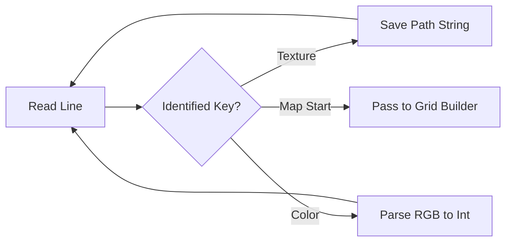

# 📝 Config Parser Module (`srcs/primitives/map/config`)

---

## 🚧 Subsystem Boundary
> [!NOTE]
> **Trigger:** Executed at the very beginning of the map parsing phase.
> 
> **Output:** Populates the texture paths and RGB color values in the global application state.

---

## ✅ Responsibilities & ❌ Anti-Responsibilities
- **Must:** Extract the 4 primary wall texture paths (NO, SO, WE, EA).
- **Must:** Parse Floor (F) and Ceiling (C) color codes in `R,G,B` format.
- **Must:** Handle whitespace and duplicate key errors in the config file.
- **Must Not:** Parse the map grid itself (delegated to `map/parse/`).
- **Must Not:** Load the XPM files into MLX (delegated to `primitives/textures/`).

---

## 🔄 Config Processing Flow

---

## 🧬 Logic Matrix
| Key | Type | Implementation |
| :--- | :--- | :--- |
| **NO/SO/WE/EA** | String | Stores path for future XPM loading. |
| **F / C** | Color | Converts triplet to `int` color value. |
| **Generic** | `parser.c` | Handles file I/O and line splitting. |

---

## ⚠️ Edge Cases & Gotchas
> [!WARNING]
> **RGB Range:** Color values must be between `0` and `255`. The parser must validate each component and trigger a "Invalid Color" error if any value is out of bounds.

---

## 🗂️ Files Inventory
| File | Primary Function | Role |
| :--- | :--- | :--- |
| `config.c` | `get_config_data()` | Primary dispatcher for config keys. |
| `parser.c` | `get_next_valid_line()` | File reader with whitespace skipping. |
