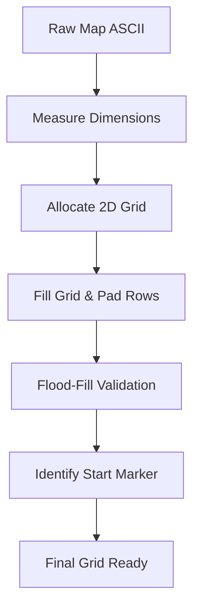

# 🏗️ Grid Builder Module (`srcs/primitives/map/parse`)

---

## 🚧 Subsystem Boundary
> [!NOTE]
> **Trigger:** Activated after the config header has been processed.
> 
> **Output:** A fully validated 2D array of characters representing the world geometry.

---

## ✅ Responsibilities & ❌ Anti-Responsibilities
- **Must:** Perform the first pass to identify the map's width and height.
- **Must:** Allocate the 2D grid and fill it with the ASCII data from the file.
- **Must:** Validate that the map is fully enclosed by '1' (walls).
- **Must:** Identify the player start position and initial orientation.
- **Must Not:** Handle floor/ceiling color parsing (delegated to `map/config/`).
- **Must Not:** Handle individual door interactions (delegated to `gameplay/`).

---

## 🔄 Construction Pipeline

---

## 🧬 Parsing Matrix
| Feature | Implementation | Purpose |
| :--- | :--- | :--- |
| **Builder** | `build.c` | Handles memory allocation for the 2D array. |
| **Validation** | `map.c` | Ensures the map is closed and player exists. |
| **XPM Check** | `xpm.c` | Verifies that texture paths point to valid files. |
| **Teardown** | `free.c` | Recursively deallocates the grid on exit. |

---

## ⚠️ Edge Cases & Gotchas
> [!CAUTION]
> **Padding & Sanitization:** The game requires a perfect 2D rectangular array. However, .cub files often have ragged, uneven lines or trailing whitespace.
> 
> The `build.c` module resolves this by finding the maximum line width and **padding the remainder of any shorter row with solid walls ('1')**.

> [!IMPORTANT]
> **Strict Whitelist Architecture:** The parser now enforces an extremely strict character whitelist (`012DOdeEGMmPpsA` and `NSEW`). 
> - If an unrecognized non-whitespace character (like `/` or `-`) is detected, parsing is instantly halted and a fatal error is thrown. No silent fallbacks.
> - This permanently prevents undefined behavior in the DDA raycaster and guarantees designers only build maps using officially supported entities.

---

## 🗂️ Files Inventory
| File | Primary Function | Role |
| :--- | :--- | :--- |
| `parse.c` | `parse_map()` | The primary orchestrator for the grid phase. |
| `build.c` | `allocate_grid()` | Memory management for the 2D char array. |
| `map.c` | `validate_map()` | Geometric integrity checks. |
| `lines.c` | `get_map_lines()` | Reads the map section into a linked list/buffer. |
