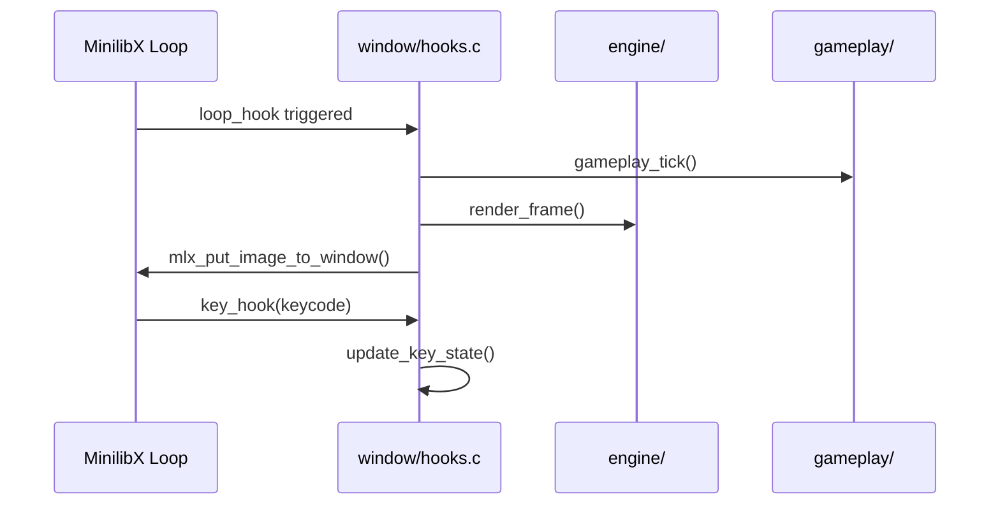

# 🖼️ Windowing Subsystem (`srcs/window`)

---

## 🚧 Subsystem Boundary
> [!NOTE]
> **Trigger:** Initialized by `core/init.c` and subsequently drives the application through MLX's internal event loop.
> 
> **Output:** A physical OS window displaying the rendered world and capturing user inputs (keyboard/mouse).

---

## ✅ Responsibilities & ❌ Anti-Responsibilities
- **Must:** Initialize the MinilibX display and window.
- **Must:** Manage the primary image buffer (pixel array) for double-buffered rendering.
- **Must:** Bind OS-level events (KeyPress, KeyRelease, DestroyNotify) to internal handlers.
- **Must:** Efficiently push the final rendered image to the window every frame.
- **Must Not:** Perform raycasting or world-to-screen transformations (delegated to `engine/`).
- **Must Not:** Parse map configurations (delegated to `helpers/`).

---

## 🔄 Event & Render Loop

---

## 💾 Memory Contracts (Critical)
| Function Allocates | Freeing Responsibility | Condition |
| :--- | :--- | :--- |
| `mlx_new_image()` | `mlx_destroy_image()` | The screen buffer image must be destroyed before the window or display is closed. |
| `mlx_new_window()` | `mlx_destroy_window()` | Managed via `safe_exit` to prevent window resource leaks. |

---

## 🧬 Graphic Pipeline Matrix
| Feature | Implementation | Notes |
| :--- | :--- | :--- |
| **Buffering** | Custom `t_data` image struct | Allows direct pixel manipulation for speed. |
| **Event Mapping** | Boolean key-state array | Supports simultaneous key presses (e.g., Forward + Strafe). |
| **Cleanup** | `safe_exit` integration | Ensures the display is closed even on unexpected crashes. |

---

## ⚠️ Edge Cases & Gotchas
> [!CAUTION]
> **X11 Connection:** If the X server connection is lost or the window is closed via the 'X' button, the system must trap the `DestroyNotify` event and trigger a clean `safe_exit`.

---

## 🗂️ Files Inventory
| File | Primary Function | Role |
| :--- | :--- | :--- |
| `window.c` | `init_window()` | Setups MLX and the primary image buffer. |
| `hooks.c` | `setup_hooks()` | Binds C functions to MLX event triggers. |
| `events.c` | `handle_keypress()` | Updates internal state based on user input. |
| `pixel.c` | `my_mlx_pixel_put()` | Low-level buffer write utility. |
